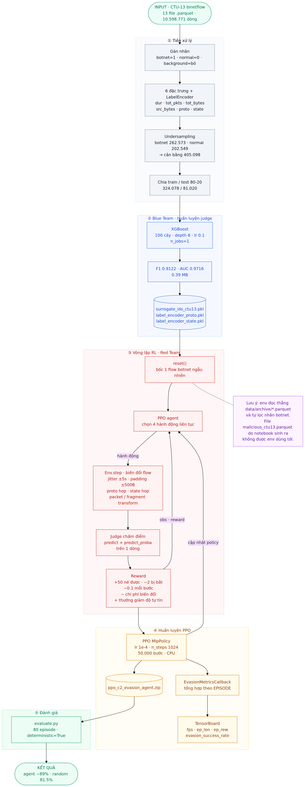

# C2 Evasion RL

[English](README.md) · **Tiếng Việt**

Agent học tăng cường (PPO) biến đổi luồng C2 botnet từ bộ dữ liệu CTU-13 để vượt qua một bộ phát hiện xâm nhập dựa trên học máy — mô hình này đóng vai phòng thủ.

Mục tiêu không phải là tạo ra công cụ tấn công hoạt động được. Mục tiêu là đo xem một kẻ tấn công thích ứng có thể gây tổn hại bao nhiêu cho bộ phát hiện, và tìm ra điểm mù của nó nằm ở đâu.

## Nguyên lý hoạt động

Hai mô hình đối đầu nhau:

- **Judge (blue team)** — bộ phân loại gradient boosting huấn luyện trên CTU-13. Nhận 6 đặc trưng luồng, trả về P(malicious). Đây là mô phỏng của một IDS.
- **Agent (red team)** — chính sách PPO chọn 4 phép biến đổi liên tục mỗi bước để đẩy xác suất đó xuống dưới ngưỡng quyết định.

Mỗi episode bắt đầu từ một luồng botnet thật. Agent biến đổi nó, judge chấm điểm, episode kết thúc khi judge nói "bình thường" hoặc sau 10 bước.

### Không gian hành động

4 giá trị liên tục trong `[-1, 1]`:

| # | Hành động | Phạm vi | Tác dụng |
|---|---|---|---|
| 0 | Jitter | ±5 giây | Dịch thời lượng luồng |
| 1 | Padding | ±500 byte | Thêm hoặc bớt byte payload |
| 2 | Nhảy giao thức | nhị phân | TCP ↔ UDP |
| 3 | Nhảy trạng thái | nhị phân | CON ↔ INT |

### Không gian quan sát

6 đặc trưng luồng đã chuẩn hóa: `dur`, `tot_pkts`, `tot_bytes`, `src_bytes`, `proto`, `state`.

### Phần thưởng

```
reward = R_evasion   nếu judge đoán bình thường
       = R_detection nếu judge đoán độc hại
       + confidence_bonus × (mức giảm P(malicious))
       − mutation_cost    × (độ lớn hành động)
       − step_penalty
```

Giá trị mặc định trong `ai_agent/config.py`: `R_evasion = 50.0`, `R_detection = −2.0`, `step_penalty = −0.1`.

## Bộ dữ liệu

[CTU-13](https://www.stratosphereips.org/datasets-ctu13) — 13 phiên bắt botnet thật (Neris, Rbot, Virut, Menti, Sogou, Murlo, NsisAy), chuyển từ binetflow sang Parquet.

| Giai đoạn | Số dòng |
|---|---|
| Ban đầu | 10.598.771 |
| Sau khi bỏ nhãn `Background` | 465.122 |
| — botnet (1) | 262.573 |
| — normal (0) | 202.549 |
| Sau undersampling | 405.098 |
| Chia train / test | 324.078 / 81.020 |

Lưu lượng `Background` bị loại bỏ hoàn toàn chứ không được coi là bình thường. Phiên bản trước gán nhãn background là "normal", tạo ra một judge không phát hiện được gì và khiến mọi con số né tránh trở nên vô nghĩa.

## Judge

Hiện tại là bộ phân loại XGBoost, 100 cây, `max_depth=6`, huấn luyện bằng `blue_team/train_surrogate_xgboost.ipynb`.

| Chỉ số | Giá trị |
|---|---|
| Accuracy | 0.9130 |
| Precision | 0.9205 |
| Recall | 0.9040 |
| F1 | 0.9122 |
| ROC AUC | 0.9716 |
| Kích thước model | 0.39 MB |

Để so sánh, RandomForest trước đó (`max_depth=15`) đạt F1 0.9359 / AUC 0.9833 với kích thước 41.85 MB.

**XGBoost ở depth 6 kém chính xác hơn RandomForest mà nó thay thế** — thấp hơn khoảng 2.4 điểm F1. Nó được chọn vì tốc độ, không phải độ chính xác, và chênh lệch tốc độ đủ lớn để đánh đổi (xem bên dưới). XGBoost ở `max_depth=15` đạt F1 0.9469 / AUC 0.9885, vượt RandomForest, nhưng cấu hình đó không phải là cấu hình đang được lưu trong `data/surrogate_ids_ctu13.pkl`.

## Vì sao huấn luyện nhanh hơn ~125 lần

Huấn luyện 50k bước giảm từ khoảng 80 phút xuống còn khoảng 3 phút. Nguyên nhân nằm ở judge, không phải mạng PPO — siêu tham số của policy không hề thay đổi.

`env.step()` gọi `judge.predict()` và `judge.predict_proba()` trên **một dòng duy nhất**, mỗi bước một lần. Với lệnh gọi một dòng, `RandomForest(n_jobs=-1)` phải tạo và hủy một thread pool của joblib mỗi lần, và chi phí điều phối đó lấn át toàn bộ thời gian duyệt cây thật. Đo trên một máy 4 core:

| Judge | Mỗi lệnh (1 dòng) | `env.step()` | Bước/giây |
|---|---|---|---|
| RandomForest `n_jobs=-1` | 96.287 µs | 189.6 ms | 5 |
| RandomForest `n_jobs=1` | 9.929 µs | — | — |
| XGBoost `n_jobs=1` | 653 µs | 1.52 ms | 659 |

Kiểm chứng độc lập từ TensorBoard: lần chạy RandomForest (PPO_19) ghi 10.5 fps, lần chạy XGBoost (PPO_20) ghi 253.6 fps. Và 1 / 96.287 ms = 10.38 bước/giây, khớp với 10.5 fps đo được — judge gần như là toàn bộ chi phí huấn luyện, khiến mạng PPO gần như không còn CPU.

Lý do `n_jobs=-1` xuất hiện ban đầu: nó thực sự đúng khi huấn luyện. Nó giảm một nửa thời gian fit (0.6 s so với 1.2 s). Nhưng cùng object model đó sau đó phục vụ khoảng 50.000 lệnh gọi một dòng, nơi cấu hình này trở thành gánh nặng. Không có cảnh báo nào.

Hai thư viện song song hóa theo cách khác nhau, đó là lý do cùng một tên tham số lại hành xử khác biệt:

| | RandomForest (sklearn) | XGBoost |
|---|---|---|
| Backend | joblib | OpenMP |
| Thread pool | Tạo mới mỗi lệnh gọi | Tái sử dụng toàn cục |
| `n_jobs=-1`, 1 dòng | 96 ms | 0.94 ms |
| `n_jobs=-1`, 1024 dòng | 153 ms | 1.57 ms (nhanh nhất) |

Nguyên tắc: đường suy luận một dòng bắt buộc phải dùng `n_jobs=1`, bất kể thư viện nào. Không bao giờ benchmark judge bằng lệnh gọi theo batch — RandomForest trông ổn ở 1024 dòng và chỉ sụp đổ khi gọi từng dòng một.

Judge không còn là nút thắt. XGBoost đạt tối đa khoảng 1.510 bước/giây trong khi huấn luyện chạy ở ~253 fps, nên mọi cải thiện tốc độ tiếp theo phải đến từ phía PPO/NumPy.

## Kết quả

Judge thực sự phát hiện được tập botnet: 90.41% trong 262.504 luồng botnet bị gán nhãn độc hại, P(malicious) trung bình = 0.846. Đây mới là con số quan trọng — với judge RandomForest cũ, P(malicious) trên lưu lượng botnet thật chỉ khoảng 0.207, nghĩa là judge gần như không phát hiện được gì và mọi con số né tránh chỉ đang đo một lỗ hổng trong mô hình chứ không phải kỹ năng của agent.

Agent đã huấn luyện, tỷ lệ né tránh theo episode, qua 24 điểm đánh giá:

| Chính sách | Tỷ lệ né tránh |
|---|---|
| Agent PPO | ~89% |
| Chính sách ngẫu nhiên (baseline) | 81.5% |

Agent chỉ hơn chính sách ngẫu nhiên khoảng 7.5 điểm phần trăm. Đó là mức chênh khiêm tốn và cần được đọc đúng như vậy — phần lớn khả năng né tránh đến từ việc judge dễ bị lừa, không phải từ việc agent học được điều gì tinh vi.

Chỉ một hành động đơn lẻ cũng xác nhận điều này:

| Hành động | Tỷ lệ né tránh |
|---|---|
| Jitter | 80.0% |
| Padding | 70.5% |
| Nhảy trạng thái | 47.0% |
| Nhảy giao thức | 43.5% |

Một hành động, áp dụng một lần, đã đạt 70–80%. Judge chính là mắt yếu.

## Callback đo chỉ số

`evasion_metrics_callback.py` ban đầu lấy trung bình cờ thành công theo từng bước, khiến độ dài episode bị trộn vào điểm số. Episode thành công kết thúc ngay và đóng góp 1 bước với cờ bằng 1, còn episode thất bại đóng góp tới 10 bước với cờ bằng 0, nên tỷ lệ báo cáo ra xấp xỉ `p / L`. Cùng một rollout cho ra ~31% dưới callback cũ và ~94% nếu tính theo episode.

Nay callback tích lũy trong một episode và chỉ ghi nhận khi episode kết thúc. Mọi callback đo chỉ số trong dự án này bắt buộc phải làm việc theo đơn vị episode. Khi một con số báo cáo mâu thuẫn với phép đếm độc lập, hãy tính lại cả hai từ rollout thô trước khi tin bất kỳ bên nào.

## Cài đặt

```bash
conda env create -f environment.yml
conda activate rl_c2_evasion
```

`environment.yml` là file phụ thuộc duy nhất — không có `requirements.txt`, dù target `install-pip` trong Makefile có nhắc tới nó.

Sinh judge và các encoder trước — agent không chạy được nếu thiếu:

```bash
cd blue_team
jupyter notebook train_surrogate_xgboost.ipynb   # ghi data/surrogate_ids_ctu13.pkl + encoder
cd ..
```

Sau đó huấn luyện và đánh giá:

```bash
make check      # kiểm tra môi trường
make train      # huấn luyện agent PPO
make tensorboard
make eval
```

Không dùng `make`: `python3 setup_check.py`, rồi `python3 train_agent.py` và `python3 evaluate.py` từ trong `ai_agent/`.

## Cấu hình

`ai_agent/config.py`:

| Tham số | Mặc định |
|---|---|
| `PPO_LEARNING_RATE` | 1e-4 |
| `PPO_N_STEPS` | 1024 |
| `PPO_BATCH_SIZE` | 32 |
| `PPO_GAMMA` | 0.99 |
| `PPO_ENT_COEF` | 0.01 |
| `TOTAL_TIMESTEPS` | 50.000 |
| `MAX_STEPS` | 10 |
| `REWARD_EVASION` | 50.0 |
| `REWARD_DETECTION` | −2.0 |

Huấn luyện chạy trên CPU (`device="cpu"` trong `train_agent.py`).

## Sơ đồ pipeline



Sơ đồ Mermaid gốc: `docs/pipeline.mmd`.

## Cấu trúc thư mục

```
ai_agent/          huấn luyện PPO, môi trường, cấu hình, callback
  c2_evasion_env.py          môi trường Gymnasium — biến đổi, phần thưởng, gọi judge
  train_agent.py             điểm vào huấn luyện
  evaluate.py                chạy policy đã huấn luyện trên các mẫu
  evasion_metrics_callback.py
  callback_metric_proof.py   chứng minh chênh lệch per-step vs per-episode
  config.py
blue_team/         huấn luyện judge
  train_surrogate_xgboost.ipynb    judge hiện tại
  train_surrogate.ipynb            judge RandomForest trước đó
  train_ids.ipynb
red_team/          hạ tầng C2 giả (Flask server, client, interceptor)
data/              luồng CTU-13, judge đã huấn luyện, label encoder
models/            policy PPO đã lưu
```

## Xử lý sự cố

**Không tìm thấy `surrogate_ids_ctu13.pkl`** — chạy `blue_team/train_surrogate_xgboost.ipynb` trước. File này bị gitignore và được sinh tại máy.

**Huấn luyện chậm hơn nhiều so với dự kiến** — kiểm tra chi phí suy luận mỗi lệnh của judge trước tiên. Judge chậm được gọi một lần mỗi bước và sẽ lấn át mọi thứ khác. Xác nhận nó dùng `n_jobs=1` trên đường một dòng.

**TensorBoard không khởi động** — `pkill -f tensorboard`, rồi `tensorboard --logdir=ai_agent/c2_ppo_tensorboard/ --port=6006`.

## Phụ thuộc

Thực tế được import trong code:

- `gymnasium`, `stable-baselines3`, `torch` — nền tảng RL
- `xgboost`, `scikit-learn`, `joblib` — judge
- `pandas`, `numpy`, `pyarrow` — dữ liệu
- `tensorboard` — đường cong huấn luyện
- `flask`, `requests` — server và client C2 giả
- `scapy`, `netfilterqueue` — chặn gói tin

`environment.yml` là danh sách có thẩm quyền. Nó cũng ghim một số gói (`shap`, `lime`, `eli5`, `wandb`, `mlflow`, `lightgbm`, `featuretools`) không được tham chiếu ở bất kỳ đâu trong code — tàn dư từ một kế hoạch trước đó.

## Hạn chế

- Judge dễ bị lừa. Một hành động đơn lẻ đạt 70–80% né tránh, nên khoảng cách của agent so với ngẫu nhiên rất nhỏ và nói nhiều về judge hơn là về agent.
- Không có vòng lặp đối kháng. Phòng thủ bị đóng băng; không có gì huấn luyện lại nó trước các chiến lược né tránh mới.
- Chỉ 6 đặc trưng luồng. Tấn công thật còn có payload, timing và DNS để khai thác.
- Agent chỉ được đánh giá với chính surrogate của nó, chưa bao giờ với một IDS khác.
- Bảng benchmark trong README trước đây liệt kê XGBoost ở F1 0.9476 / AUC 0.9888 / 7.5 MB và gọi đó là thắng ở mọi chỉ số. Những con số đó thuộc về một biến thể `max_depth=15` không được dùng; model triển khai là `max_depth=6` và cho điểm thấp hơn RandomForest mà nó thay thế.

## Hướng tiếp theo

1. Cải thiện judge — bỏ undersampling quá tay, thêm đặc trưng, thêm regularization. Mục tiêu: P(malicious) cao trên luồng botnet chưa biến đổi.
2. Luôn báo cáo baseline chính sách ngẫu nhiên kèm theo số của agent. Không có nó thì tỷ lệ né tránh vô nghĩa.
3. Khép vòng lặp — huấn luyện lại phòng thủ trước các chiến lược của agent.
4. Kiểm tra chuyển giao: agent có còn né được một IDS mà nó chưa từng huấn luyện chống lại không?

## Tham khảo

- [Bộ dữ liệu CTU-13](https://www.stratosphereips.org/datasets-ctu13)
- [Stable-Baselines3](https://stable-baselines3.readthedocs.io/)
- [Gymnasium](https://gymnasium.farama.org/)
